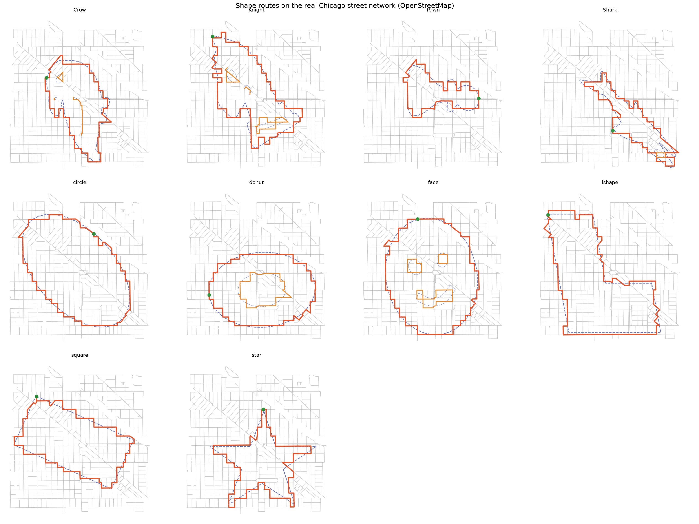
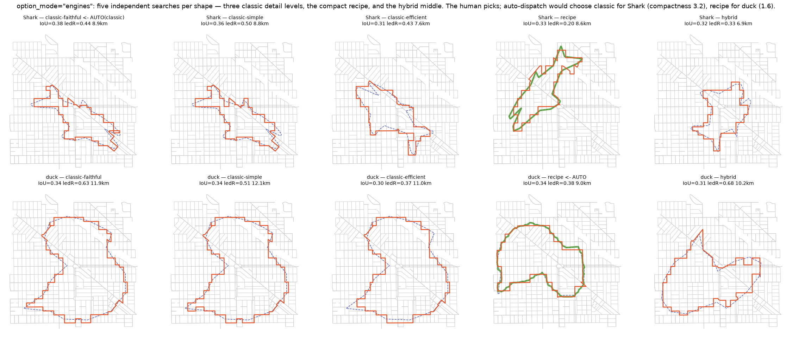
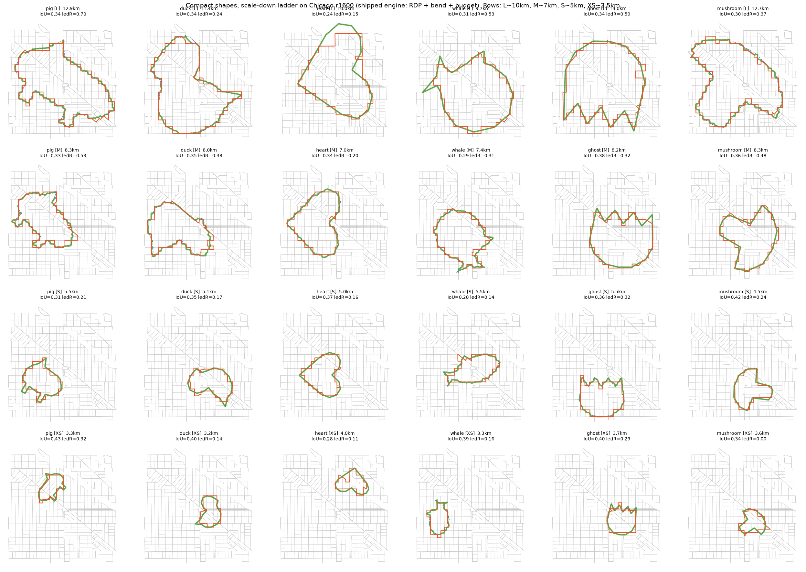

<h1 align="center">svg2gpx</h1>

<p align="center">
  <b>Turn any SVG shape into a runnable <a href="#">GPS&nbsp;art</a> route on real city streets.</b><br>
  The automatic, open-source way to make <b>Strava art</b> — no hand-drawing required.
</p>

<p align="center">
  
  
  
  
</p>

<p align="center">
  
  <br>
  <sub><i>Every bundled shape, routed on the real Chicago street network. Orange = the runnable route, blue dashed = the target outline, orange interior lines = inner features (the face's eyes and smile, the donut's hole).</i></sub>
</p>

---

**svg2gpx** takes an SVG silhouette and a location, lays the shape over a city's
walkable street network, and generates a single **closed running route** whose
path resembles the shape — a boar, a star, a heart — drawn in streets you can
actually run or ride. Unlike the hand-draw GPS art planners, it **fits and routes
the shape automatically**, and it ships a **fidelity engine** that measures how
faithfully the route reproduces your shape — so quality is a number you can track
and tune, not just something you eyeball.

Routes export as GeoJSON (WGS84) plus map images today; a one-hop conversion to
**GPX** drops them straight into **Strava**, **Garmin**, or **Komoot**.

## ✨ Why svg2gpx

- 🎨 **Automatic, not hand-drawn.** Feed it an `<svg>` — it searches scale,
  rotation, offset and stretch to seat the figure on the streets and routes it for
  you. No dragging a pen across a map.
- 🧭 **Real street networks.** Snaps to the actual walkable graph from
  OpenStreetMap (via OSMnx), so every route is a connected walk on real roads.
- 📐 **A fidelity engine, not a guess.** Seven complementary metrics — Fréchet,
  Hausdorff, IoU, DTW, turning distance, a perceptual render-compare, and a
  **feature ledger** — score how recognizably the route reads as the shape.
- 👀 **Inner features.** Eyes, a smile, a donut's hole, a wing line — interior
  detail is extracted and drawn too, not just the silhouette.
- 🧠 **Per-shape engine.** A compactness test routes blobby shapes and
  elongated/protruding ones through the strategy that measured best for each.
- 🔁 **Reproducible.** A fast synthetic-grid mode runs offline and deterministically
  for CI and benchmarking — no network required.

## 🚀 Quick start

```bash
git clone https://github.com/Chieler/svg2gpx.git
cd svg2gpx

pip install -r requirements.txt        # core: synthetic-grid runs, offline
pip install -r requirements-osm.txt    # extra: real OpenStreetMap data + plotting
```

`skia-python` needs system GL libraries on Linux:

```bash
sudo apt-get install -y libegl1 libgl1
```

Generate your first route:

```bash
python gen.py --svg shapes/star.svg --lat 41.9285 --lng -87.7075 --save star.png
```

## 🖼️ Gallery

Pick the placement that reads best, tune detail, or let the shape choose its own
engine — the search returns several routings so you can eyeball the winner.

| Five detail/engine options per shape | Fidelity across scales (how short a route can still read) |
| :---: | :---: |
|  |  |

## 🧠 How it works

The pipeline (`gen.py`) runs end to end:

| Stage | Function | What it does |
| --- | --- | --- |
| 1. Build grid | `build_grid` | Pull and normalize the walkable street network (and parks) into `[0, 1]` space. |
| 2. Extract shape | `extract_shape` | Render the SVG and trace its outer outline **and inner features** as polylines. |
| 3. Search placement | `search_placement` | Find the scale / rotation / offset / stretch that seats the shape on the streets with the best *routed* fidelity. |
| 4. Snap waypoints | `snap_waypoints` | Densify the placed outline and snap points to street nodes — dense anchors so each hop barely deviates. |
| 5. Route | `route_contour` | Walk consecutive anchors with a contour-biased Dijkstra so the path hugs the shape. |
| 6. Cleanup + plot | `cleanup`, `plot` | Close the loop, dissolve backtracks / combs / nooks, report fidelity, draw. |

Fidelity comes from **dense waypoints**: spacing anchors well below one block means
each Dijkstra hop is short and has little room to stray. The dominant quality lever
is **resolution** (blocks per shape) — a bigger canvas or a denser street fabric
reads better, at the cost of a longer route.

## 📐 Fidelity metrics

Each metric catches a failure the others miss (all in `gen.py`):

| Metric | Answers |
| --- | --- |
| **Fréchet** | Order-aware worst-case leash — punishes out-of-sequence detours. |
| **Hausdorff** | The single largest excursion from the outline. |
| **IoU** | Area overlap of the two thickened outlines. |
| **Perceptual cost** | Blur-tolerant render-and-compare (`1 − soft-IoU`) — the gestalt the eye sees. |
| **DTW** | Cyclic dynamic time warping — rewards hugging the outline *everywhere*, not just at the worst point. |
| **Turning distance** | Scale/rotation-invariant measure of **form** (corners, protrusions) that ignores staircase jitter. |
| **Feature ledger** | Recall / precision of the shape's **defining corners** — catches a feature vanishing when IoU can't. |
| **On-land % · distance** | Runnability sanity checks. |

Read together they tell you *how* a result is good or bad — path order (Fréchet/DTW),
one bad excursion (Hausdorff), overall area (IoU), and whether the identity-carrying
corners landed (turning distance, feature ledger).

## 🛠️ Usage

<details open>
<summary><b>Generate a route</b></summary>

```bash
python gen.py                                       # CONFIG defaults
python gen.py --svg shapes/Crow.svg --granularity 0.8
python gen.py --lat 41.9285 --lng -87.7075 --save route.png --no-show
```

Common knobs are CLI flags (`--svg`, `--lat/--lng/--radius`, `--granularity`,
`--graphml`, `--seed`, `--save`, `--no-show`, `--no-inner-features`); everything
else is tuned from the `CONFIG` dict in `gen.py`. `--graphml` loads a saved OSMnx
network for offline / reproducible runs.
</details>

<details>
<summary><b>Trace every shape on the real Chicago map</b></summary>

```bash
python chicago_map.py                 # all shapes, Logan Square window
python chicago_map.py --shape star    # one shape
python chicago_map.py --live          # fetch fresh OSM data instead
```

Renders each route on the real OSMnx map plus a gallery image, and writes per-shape
GeoJSON (WGS84) and a metrics CSV to `chicago_maps/`.
</details>

<details>
<summary><b>Benchmark fidelity across shapes</b></summary>

```bash
python benchmark.py                 # synthetic grid, all shapes (offline, CI-friendly)
python benchmark.py --grid-size 60  # finer lattice
python benchmark.py --real          # real OSM (cached on disk)
python benchmark.py --json          # also write benchmark_results.json
```
</details>

<details>
<summary><b>Pick the best route per shape</b></summary>

```bash
python best_route.py                # all shapes, synthetic grid
python best_route.py --shape star   # just one shape
python best_route.py --grid real    # real OSM
```

Routes the top candidate placements, selects the lowest-cost one, and upserts its
metrics into [`result.csv`](result.csv) — one "best route" row per shape.
</details>

## 🧩 Shapes

Eighteen SVGs live in [`shapes/`](shapes) — animals (`Horse`, `Shark`, `Crow`,
`Cat`, `pig`, `duck`, `whale`, `ghost`), figures (`Knight`, `Pawn`, `face`), and
geometric primitives (`square`, `circle`, `star`, `heart`, `donut`, `mushroom`,
`lshape`). Drop any `<polygon>` / `<path>` SVG in there and the benchmark, Action
and Chicago map pick it up automatically — no code changes.

### Inner features

`extract_shape()` finds a shape's **inner features** from the raster's ink/paper
contour tree and routes them alongside the outline:

- **holes** — a donut's hole, an eye (closed loops);
- **disconnected elements** — a face's eyes and smile (closed loops);
- **interior strokes** — a wing line, a horse's mane (open paths, run as out-and-back spurs).

Placement folds each candidate's **feature fidelity into its cost**, so a route that
seats the body nicely but strands the eye ranks below one that draws both. Small
features get extra rescues (feature-scaled smoothing and per-feature re-seating on
the local street fabric). Toggle with `inner_features=False` or `--no-inner-features`.
Visual check: `python preview_features.py`.

## 📊 Continuous fidelity tracking

The **Best Route** GitHub Action
([`.github/workflows/best-route.yml`](.github/workflows/best-route.yml)) runs
`best_route.py` on demand (`workflow_dispatch`) and commits the updated `result.csv`
back to the repo, so fidelity is tracked over time.

## 🗺️ Roadmap

- [ ] **GPX export** — make the name literal: one flag to write `.gpx` for Strava / Garmin / Komoot.
- [ ] **PyPI package** — `pip install svg2gpx` + a proper `svg2gpx` CLI.
- [ ] **Walk-network resolution** — alleys and footpaths for ~2× finer routes.
- [ ] **Semantic recognizability judge** — a sketch classifier as a dev-time oracle.

## 📦 Repository layout

```
gen.py               # the full SVG -> street-route pipeline + fidelity metrics
chicago_map.py       # route every shape on the real Chicago OSM network
benchmark.py         # fidelity + runtime benchmark over all shapes
best_route.py        # best-of-N selection -> result.csv
preview_features.py  # visualize extracted inner features
shapes/              # sample input SVGs
docs/                # design notes and comparison figures
.github/workflows/   # Best Route GitHub Action
```

## 🤝 Contributing

Issues and PRs are welcome. Before opening a PR, run the checks:

```bash
python test_routing.py          # routing / connectivity
python test_inner_features.py   # inner-feature extraction
python benchmark.py             # fidelity smoke on the synthetic grid
```

## 📄 License

[MIT](LICENSE) © Chieler.

---

<sub><i>Keywords: GPS art · Strava art generator · GPS drawing · SVG to GPX · SVG to
route · running route art · GPX route maker · route art · OpenStreetMap · running ·
cycling · fitness map art.</i></sub>
